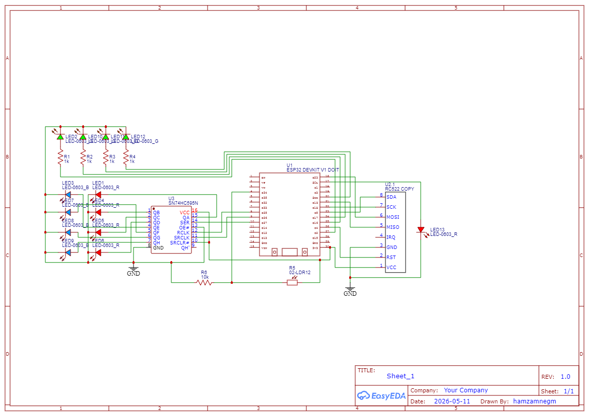

# Circuit Schematic — Adaptive Traffic Light System

## 1. Overview

Designed in EasyEDA by hamzamnegm, REV 1.0, dated 2026-05-11.



Microcontroller: **ESP32 DEVKIT V1 DOIT**

---

## 2. Sensors & Input Components

| Component | Part Number | Pin(s) | Purpose |
|-----------|-------------|--------|---------|
| RFID Reader | MFRC522 | SS=GPIO5, RST=GPIO4, MOSI/MISO/SCK (default SPI) | Detects card scan to trigger 5-second all-red emergency phase; 15-second cooldown between triggers |
| LDR (photoresistor) | — | GPIO34 (ADC) | Reads ambient brightness (0–4095 mapped to 0–100%); activates night mode below threshold, doubling all green phase durations |

---

## 3. Output Components

### Shift Register

| Part | Pins | Function |
|------|------|----------|
| 74HC595N | DATA=GPIO27, CLK=GPIO26 (SRCLK), LATCH=GPIO25 (RCLK) | Drives 8 LEDs: Q0–Q3 = red LEDs (Top/Bottom/Left/Right), Q4–Q7 = yellow LEDs (Top/Bottom/Left/Right) |

### LEDs

| LED | GPIO | Color | Resistor | Notes |
|-----|------|-------|----------|-------|
| LED1 (Top Red) | 74HC595 Q0 | Red | — | Via shift register |
| LED2 (Bottom Red) | 74HC595 Q1 | Red | — | Via shift register |
| LED3 (Left Red) | 74HC595 Q2 | Red | — | Via shift register |
| LED4 (Right Red) | 74HC595 Q3 | Red | — | Via shift register |
| LED5 (Top Yellow) | 74HC595 Q4 | Yellow | — | Via shift register |
| LED6 (Bottom Yellow) | 74HC595 Q5 | Yellow | — | Via shift register |
| LED7 (Left Yellow) | 74HC595 Q6 | Yellow | — | Via shift register |
| LED8 (Right Yellow) | 74HC595 Q7 | Yellow | — | Via shift register |
| LED9 (Top Green) | GPIO2 | Green | 1kΩ | Direct GPIO |
| LED10 (Bottom Green) | GPIO16 | Green | 1kΩ | Direct GPIO |
| LED11 (Left Green) | GPIO17 | Green | 1kΩ | Direct GPIO |
| LED12 (Right Green) | GPIO21 | Green | 1kΩ | Direct GPIO |
| LED13 (Emergency) | GPIO22 | — | — | Active during all-red emergency phase |

Total: 13 LEDs (LED1–LED13).

---

## 4. Pin Mapping Summary

| GPIO | Function | Direction |
|------|----------|-----------|
| GPIO2 | Green LED — Top | Output |
| GPIO4 | MFRC522 RST | Output |
| GPIO5 | MFRC522 SS (CS) | Output |
| GPIO16 | Green LED — Bottom | Output |
| GPIO17 | Green LED — Left | Output |
| GPIO21 | Green LED — Right | Output |
| GPIO22 | Emergency LED | Output |
| GPIO25 | 74HC595 LATCH (RCLK) | Output |
| GPIO26 | 74HC595 CLK (SRCLK) | Output |
| GPIO27 | 74HC595 DATA | Output |
| GPIO34 | LDR ADC input | Input (ADC) |
| MOSI | MFRC522 MOSI | SPI |
| MISO | MFRC522 MISO | SPI |
| SCK | MFRC522 SCK | SPI |

---

## 5. LDR Circuit

The LDR is wired as a voltage divider: the LDR connects between 3.3V and the junction node, and a 10kΩ pull-down resistor connects from that junction to GND. The junction feeds GPIO34 (ADC).

```
3.3V
 |
[LDR]
 |
 +-----> GPIO34 (ADC)
 |
[10kΩ]
 |
GND
```

As ambient light decreases, LDR resistance increases, pulling the ADC voltage lower. The firmware maps the raw 0–4095 ADC reading to a 0–100% brightness value and enables night mode when it drops below the configured threshold.
